# tau-city

Tau digits to synestesia mnemonic converter

## Tau

Tau (τ = 2π = 6.283...), the name for the ratio constant of a circle's circumference to its radius

The first 200 decimals of tau 

```
6.
2831853071 7958647692 5286766559 0057683943 3879875021 
1641949889 1846156328 1257241799 7256069650 6842341359 
6429617302 6564613294 1876892191 0116446345 0718816256 
9622349005 6820540387 7042211119 2892458979 0986076392 
...
```

## Help-screen

```
$ runhaskell tau-img-png-opts.hs --help
tau - tau desimals to synestesia mnemonic converter

Usage: tau-img-png-opts.hs [-s|--scheme SCHEME] [--output PNGFILE]
                           [--fromchrs FROMCHRS] [--onlychrs ONLYCHRS] [--loop]
                           [-c|--cols COLS] [-r|--rows ROWS] [--height HEIGHT]
  Tau Synesthesia

Available options:
  -h,--help                Show this help text
  -s,--scheme SCHEME       Color scheme: set1, set2, ...
  --output PNGFILE         Create a PNG image file with the given name
  --fromchrs FROMCHRS      Take input from given string instead, non-digit means
                           newline, e.g. "12345 67890"
  --onlychrs ONLYCHRS      Print only these chars, e.g. "13579" for odds only
  --loop                   Loop over ONLYCHRS, printing multiple pictures
  -c,--cols COLS           Number of colums (x) at every line
  -r,--rows ROWS           Number of lines (y) to print
  --height HEIGHT          Height of each picture (one digit) in pixels
```

## Examples

With default parameters the program will write a png-file to `output.png`:

```
$ runhaskell tau-img-png-opts.hs
Created: output.png
Size: 568x568 pixels
```

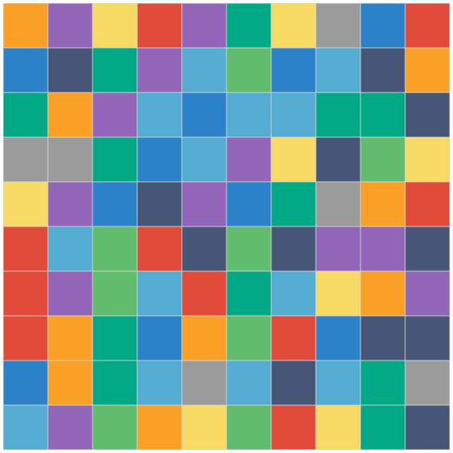

Key to colors can be formatted by giving the `--fromchrs` option. A non-digit  means newline.  The string "12345 67890" is thus positioned in the following manner:

```
12345
67890
```

```
$ runhaskell tau-img-png-opts.hs --fromchrs "12345 67890" --output output/key-set1.png
Created: output/key-set1.png
Size: 288x120 pixels
```


With scheme `set2` and individual block height of `30` pixels:

```
$ runhaskell tau-img-png-opts.hs --scheme=set2 --height=30 --output output/set2-height30.png
```

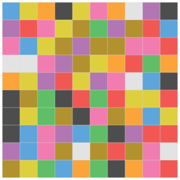

And the key for it:

```
$ runhaskell tau-img-png-opts.hs --scheme=set2 --fromchrs "12345 67890" --height=30 --output output/key-set2-height30.png
```


The `set3` is the topographic scheme, with the key:


```
$ runhaskell tau-img-png-opts.hs --scheme=set3 --height=30 --output output/set3-height30.png
```

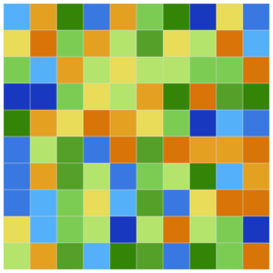


Now let's get grazy! 10000 digits in gray scale scheme `set4`, with the key:

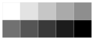

```
$ runhaskell tau-img-png-opts.hs --scheme=set4 --cols=100 --rows=100 --height=4 --output output/gray-scale-set4-100x100.png
```

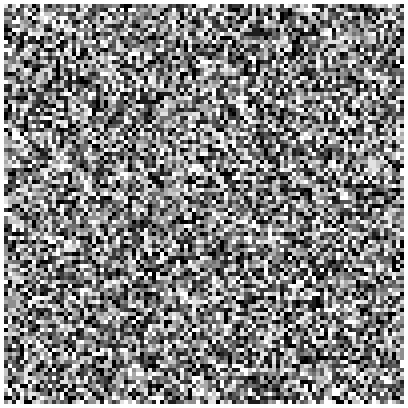


The scheme `set5` includes the actual numbers.

```
$ runhaskell tau-img-png-opts.hs --scheme=set5 --height=30 --output output/set5-height30.png
```

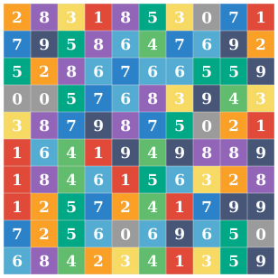

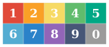


The schemes `set6` and `set7` paint a road network (or something like that), the key being the numeric keypad.

```
$ runhaskell tau-img-png-opts.hs --scheme=set6 --height=20 --output output/set6-height20.png
```

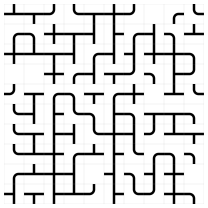

```
$ runhaskell tau-img-png-opts.hs --scheme=set7 --height=20 --output output/set7-height20.png
```

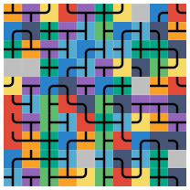

```
$ runhaskell tau-img-png-opts.hs --scheme=set7 --fromchrs "789 456 123 0" --height=20 --output output/key-set7-height20.png
```


## Looping over one-digit tables

To show only a selected set of digits, we use the option `--onlychrs`. By including the option `--loop` we can output all the other pictures with similar pattern, too.

```
$ runhaskell tau-img-png-opts.hs --onlychrs="1" --loop --height=12 --output output/set1-height12.png
```

     

    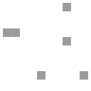 

## Looping over two-digit tables

```
runhaskell tau-img-png-opts.hs --onlychrs="05" --loop --height=12 --output output/set1-two-digit.png
```

    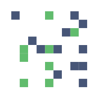


## Looping over three-digit tables

```
runhaskell tau-img-png-opts.hs --onlychrs="147" --loop --height=12 --output output/set1-three-digit.png
```

    

  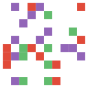  

