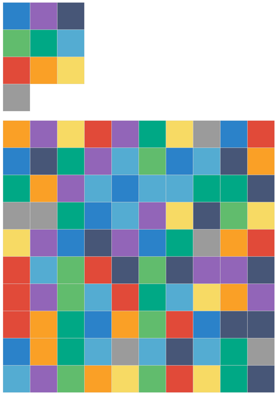
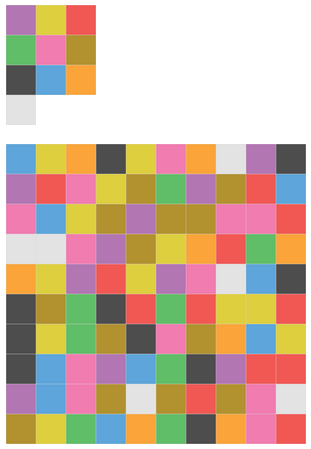
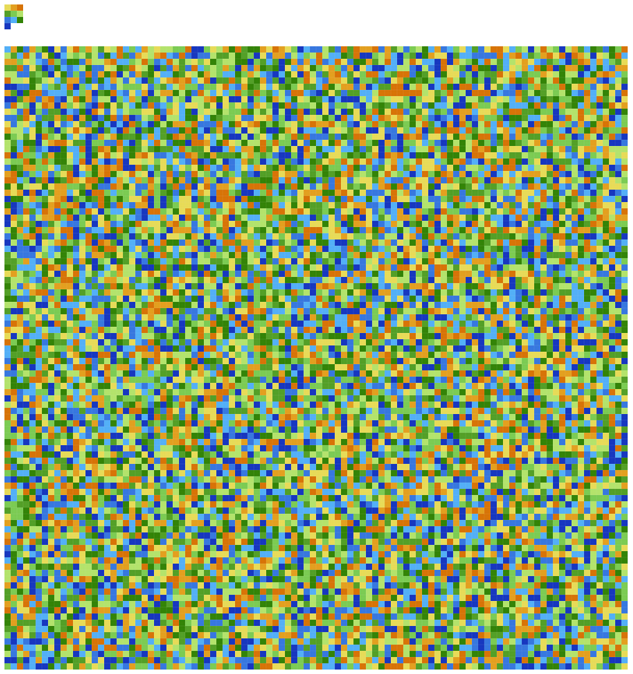
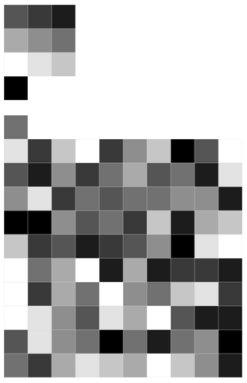
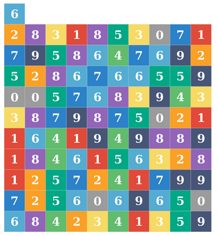
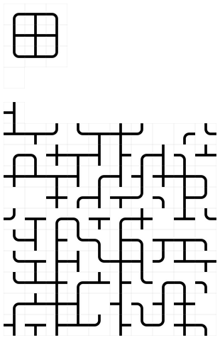
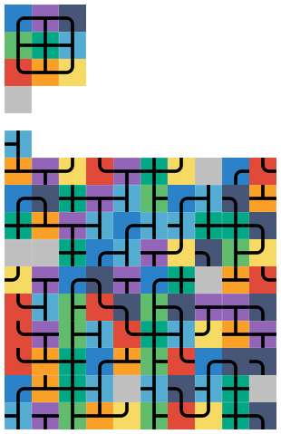

# tau-city

Tau digits to synestesia mnemonic converter

Tau (τ = 2π = 6.283...), the name for the ratio constant of a circle's circumference to its radius

The first 200 decimals of tau 

```
6.
2831853071 7958647692 5286766559 0057683943 3879875021 
1641949889 1846156328 1257241799 7256069650 6842341359 
6429617302 6564613294 1876892191 0116446345 0718816256 
9622349005 6820540387 7042211119 2892458979 0986076392 
...
```

tau-html-img-opts help-screen

```
$ runhaskell tau-html-img-opts.hs --help
tau - tau desimals to synestesia mnemonic converter

Usage: tau-html-img-opts.hs [-s|--scheme SCHEME] [-c|--cols COLS]
                            [-r|--rows ROWS] [-h|--height HEIGHT] [--nokey]
                            [--ones]
  Tau Synesthesia

Available options:
  -h,--help                Show this help text
  -s,--scheme SCHEME       color scheme: set1, set2, ...
  -c,--cols COLS           Number of colums (x) at every line
  -r,--rows ROWS           Number of lines (y) to print
  -h,--height HEIGHT       Height of each picture (one digit) in pixels
  --nokey                  Don't print the key (picture of numeric keypad)
  --ones                   Print ones (the number 6 for tau)
```

## Examples

With default parameters the program will output the following html-page containing the image collage:

```
$ runhaskell tau-html-img-opts.hs >tau-city-default.html
```



With scheme `set2` and individual block height of `30` pixels:

```
$ runhaskell tau-html-img-opts.hs --scheme=set2 --height=30 >tau-city-set2-h30.html
```



Now let's get grazy! 10000 digits in topographic scheme `set3`:

```
$ runhaskell tau-html-img-opts.hs --scheme=set3 --cols=100 --rows=100 --height=7 >tau-city-set3-100x100h7.html
```



A gray scale image (`set4`). By default only decimals are shown and the integer part is ignored, but it can be included with the `--ones` flag:

```
$ runhaskell tau-html-img-opts.hs --scheme=set4 --ones --height=30 >tau-city-set4-ones-h30.html
```



The scheme `set5` includes the actual numbers, so we can omit the picture of keypad:

```
$ runhaskell tau-html-img-opts.hs --scheme=set5 --nokey --ones --height=30 >tau-city-set5-nokey-ones-h30.html
```



The schemes `set6` and `set7` paint a road network (or something like that)

```
$ runhaskell tau-html-img-opts.hs --scheme=set6 --ones --height=30 >tau-city-set6-ones-h30.html
```



```
$ runhaskell tau-html-img-opts.hs --scheme=set7 --ones --height=30 >tau-city-set7-ones-h30.html
```


